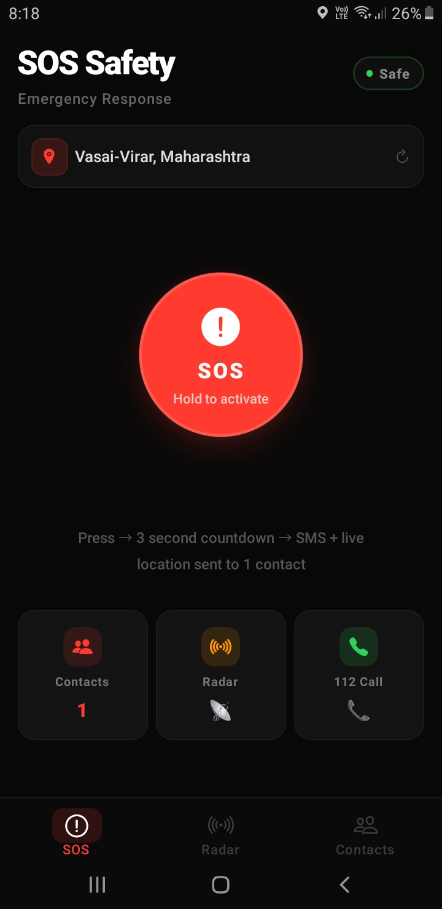
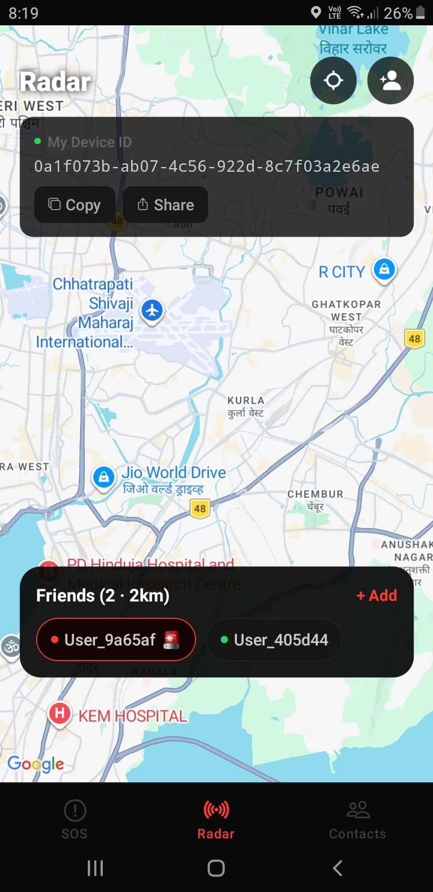
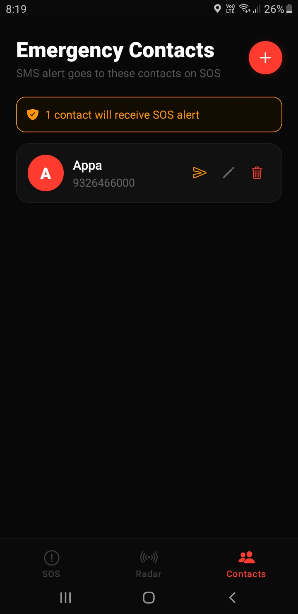

# 🔴 SOS Radar Safety App

SOS Radar Safety App is a real-time women safety and emergency response mobile application built using **React Native (Expo)** and **Firebase**. It is designed to enable fast, reliable communication during emergencies through a trusted and closed safety network.

---

## 📱 Overview

The app allows users to build a trusted network using a **friend request system (device ID-based, upgradeable to authentication)**.

When an SOS is triggered, the system sends alerts **in parallel** to:
- 📞 Selected emergency contacts from the phonebook  
- 📡 Nearby trusted friends using a radar-based geolocation system  

If a nearby trusted friend responds with “I’m coming”, both users are connected through **real-time mutual location tracking** until the situation is resolved.

This ensures help is always reachable through both **local proximity support and emergency contact backup**, improving response time in critical situations.

---

## 🚨 Key Features

- 🔴 One-tap SOS emergency alert system  
- 👥 Trusted network via friend requests (device ID-based, upgradeable to authentication)  
- 📍 Real-time geolocation tracking and sharing  
- 📡 Radar-based proximity detection of nearby trusted friends  
- 📢 Parallel alert system (phonebook contacts + nearby trusted users)  
- 🤝 “I’m coming” response system for helpers  
- 🧭 Live mutual location tracking until assistance arrives  
- 🔥 Firebase real-time database for instant updates  
- 🔐 Secure, closed-network safety system (no unknown users)

---

## 🎯 Purpose

To create a fast, intelligent, and reliable emergency response system that prioritizes trusted contacts and nearby connections, ensuring immediate assistance during critical situations.

---

## 🔄 How It Works

1. User triggers SOS via app  
2. Alert is sent simultaneously to:
   - Emergency contacts (phonebook)
   - Nearby trusted friends (radar system)  
3. If a user accepts (“I’m coming”)  
4. Both users enter live location sharing mode  
5. Continuous tracking continues until safety is restored

📸 Screenshots
<table>
  <tr>
    <td align="center">
      
       
      <b>SOS Home</b>
       
      Hold-to-activate SOS · Location display · Contacts, Radar & 112 shortcuts
    </td>
    <td align="center">
      
       
      <b>Radar</b>
       
      Live map · Nearby friends within 2km · Device ID sharing
    </td>
    <td align="center">
      
       
      <b>Emergency Contacts</b>
       
      Add / manage contacts · SMS alert on SOS trigger
    </td>
  </tr>
</table>

